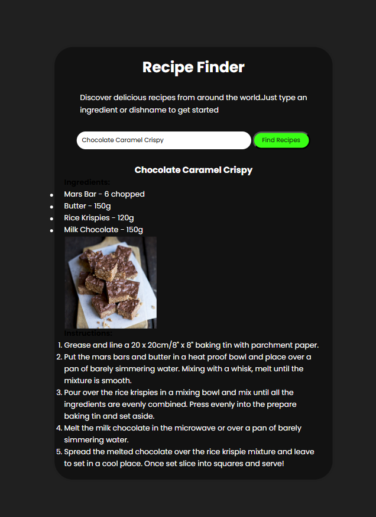

# Recipe Finder

A simple web application for finding recipes using TheMealDB API. This project was built to learn fundamental web development concepts including HTML, CSS, JavaScript, and API integration.I know this is not a good project but it improved my fundamentals and moreover I enjoyed it.

## Features

- Search for recipes by name.
- View the recipe image, name, and instructions.
- Responsive design and modern color palette.

## How to Use

Simply type an ingredient or dish name into the search bar and click "Find Recipes".

## Technologies Used

- HTML
- CSS
- JavaScript
- TheMealDB API

## Screenshots

